# Basic graphics in R
*[Ashkan Mirzaee](https://ashki23.github.io/index.html)*

[R](https://www.r-project.org/) is a great tool for creating plots, maps
and graphics. R includes many built-in graphics functions that would
help to draw plots easily. R is a very self explanatory environment in
terms of documentation. We can learn about any R commands only by using
`help(command)`. The following is a list of the most practical graphics
functions in R:

  - `plot`: Generic function for plotting of R objects
  - `lines`: A generic function taking coordinates and joining the
    corresponding points with line segments
  - `ablines`: This function adds one or more straight lines through the
    current plot
  - `points`: A generic function to draw a sequence of points at the
    specified coordinates
  - `panel.smooth`: Simple panel plot
  - `smoothScatter`: Produce a smoothed color density representation of
    a scatterplot,
  - `pairs`: Produce a matrix of scatter plots
  - `hist`: Computes a histogram of the given data values
  - `acf`: Computes (and by default plots) estimates of the
    autocorrelation function
  - `boxplot`: Produce box-and-whisker plot(s) of the given (grouped)
    values
  - `barplot`: Creates a bar plot with vertical or horizontal bars
  - `dotchart`: Draw a Cleveland dot plot
  - `pie`: Draw a pie chart
  - `polygon`: Polygon draws the polygons whose vertices are given in x
    and y
  - `symbols`: This function draws symbols on a plot
  - `arrows`: Add arrows to a plot
  - `axis`: Add an axis to a plot
  - `stars`: Draw star (segment) plots and spider (radar) plots
  - `contour`: Create a contour plot, or add contour lines to an
    existing plot
  - `image`: Creates a grid of colored or gray-scale rectangles with
    colors corresponding to the values in z
  - `persp`: This function draws perspective plots of a surface over the
    x–y plane

There are several graphical parameters that can be specified in the
graphics functions or through parameter function, `par()`, before the
graphs. Most important graphical parameters:

  - `ann`: Plots annotations which is axis titles and overall titles,
    `ann = FALSE` means no titles
  - `bg`: Background color
  - `bty`: Border type, `bty = "n"` means border type is NULL
  - `cex`: A value giving the amount which plotting text and symbols
    should be magnified relative to the default
  - `las`: Labels axis style
  - `lty`: Lines types
  - `lwd`: Lines width
  - `main`: Plot main title
  - `mfrow`: Multiple figures in rows, it is a vector of the form
    `c(nr,nc)`
  - `pch`: Points character
  - `xaxt/yaxt`: X-axis/y-axis style, `xaxt = "n"` means no scale on
    x-axis
  - `xlab/ylab`: X-axis/y-axis label
  - `xlim/ylim`: X-axis/y-axis limit

This tutorial shows how to apply above functions and parameters to draw
graphs by R. We will also, briefly learn how to generate publication
style tables and maps.

-----

## Scatter plots, lines and points

``` r
x = 1:100
y = rnorm(100, 0, 2)

## Left plot
par(mfrow = c(1,2))
plot(x, y, las = 1, xaxt = "n")
axis(1, at = c(0,25,50,75,100), labels = c('O','A','B','C','D'))
panel.smooth(x, y, col = "blue")

## Right plot
plot(x, y, type = "l", col = "blue", ylab = "", yaxt = "n", las = 2)
lines(smooth(y), col = "red", lty = 1, lwd = 1.4)
abline(h = 3, v = 80, col = "orange", lwd = 3)
abline(h = 0, lty = 2, lwd = 2)
points(c(20,40,60,80,100), c(0,-1,1,3,2), col = "black", bg = "green", pch = 21, cex = 2)
text(x = c(40,80), y = c(-1.2,3.2), labels = c("MIN","MAX"), pos = c(1,3), col = "red",  cex = 0.9)
```

<p align="center">

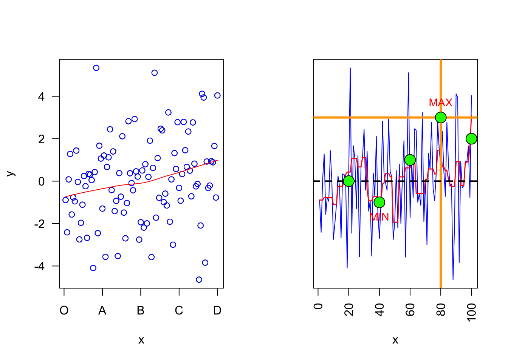

</p>

## Probability density functions

``` r
par(mfrow = c(1,2))

## Left plot
plot(density(y, bw = 2), main = "")

## Right plot
y2 = rnorm(100, 4, 2)
plot(density(y, bw = 1), col = "blue", main = "")
lines(density(y2, bw = 1), col = "red")
legend("topleft", legend = c("Line 1", "Line 2"), title = "Line types", lty = 1:2, lwd = 1,  col = c("red", "blue"), cex = 0.7, box.lty = 0, bg = rgb(0,0,0,0))
```

<p align="center">

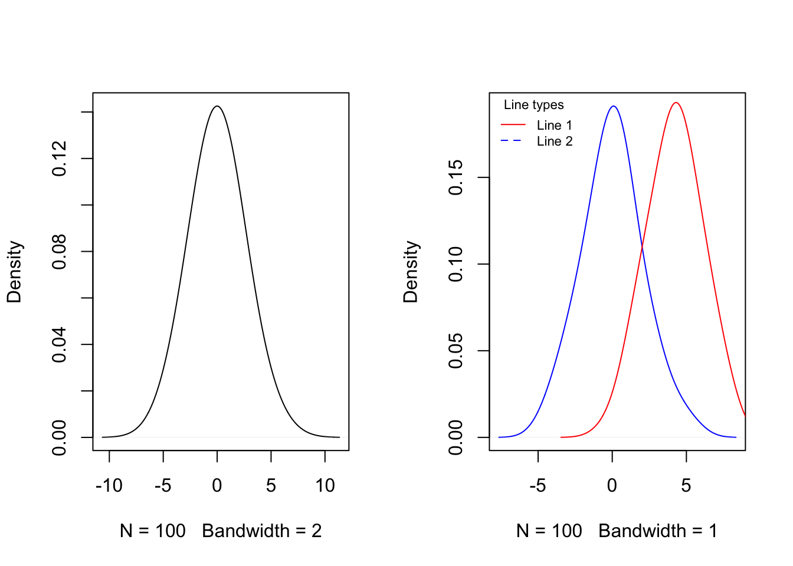

</p>

``` r
## Left plot
seq = seq(-10, 10, length.out = 100)
f = dnorm(seq, 0, 2)
plot(seq, f, col = colorRampPalette(c("red","yellow","springgreen","royalblue"))(100))
legend("topright", legend = c("Point 1", "Point 2"), title = "Point types", pch = c(22,21),  col = c("red", "blue"), pt.bg = c("gold", "green"), cex = 0.75, pt.cex = 1.2, box.col = "black", box.lty = 1 , box.lwd = 1, inset = c(0.02, 0.015))
polygon(seq, f, density = 10, col = "gray", border = NA)

## Right plot
plot(seq, f, type = "l", col = "red", lwd = 3)
polygon(seq, f, density = NA, col = "gold", border = NA)
polygon(c(2, seq[seq >= 2]), c(0, f[seq >= 2]), density = NA, col="green", border = NA)
```

<p align="center">

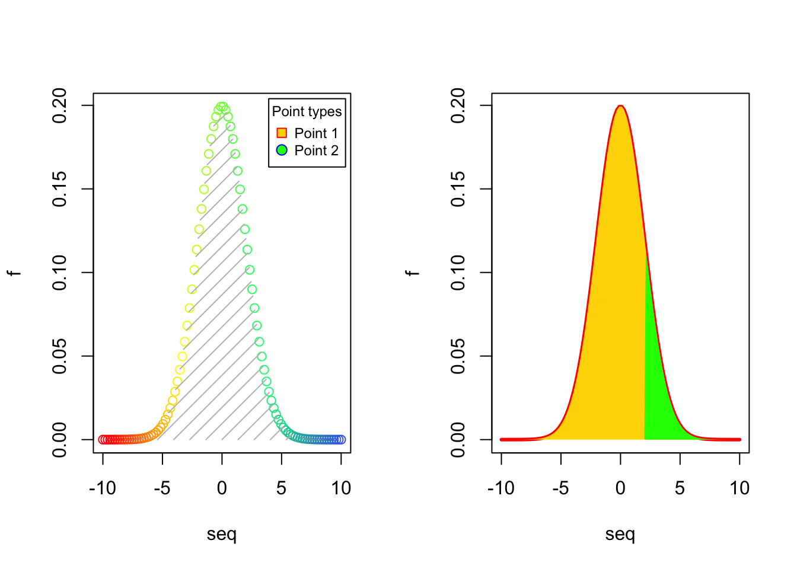

</p>

## Histograms

``` r
par(mfrow = c(1,2))

## Left plot
hist(y, col = "orange", density = 10, main = "", xlab = "")

## Right plot
hist(y, col = cm.colors(10), probability = TRUE, main = "", xlab = "")
lines(seq, f, col = "blue", lty = 1, lwd = 2)
```

<p align="center">

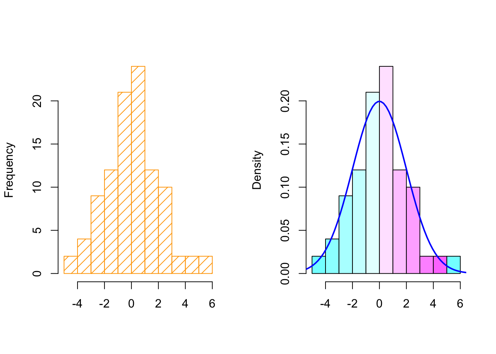

</p>

## Box plots and autocorrelations

``` r
par(mfrow = c(1,2))

## Left plot
boxplot(y, y2, col = c("orange", "gold"))
abline(h = 0)

## Right plot
acf(y, main = "")
```

<p align="center">

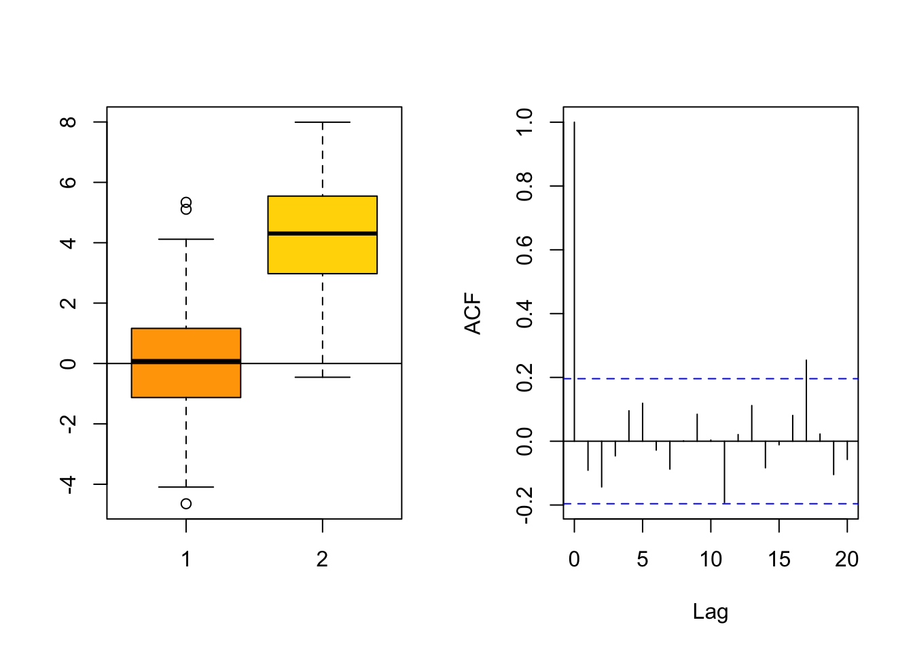

</p>

``` r
boxplot(count ~ spray, data = InsectSprays, ylab = "Number of var", col = cm.colors(6))
```

<p align="center">

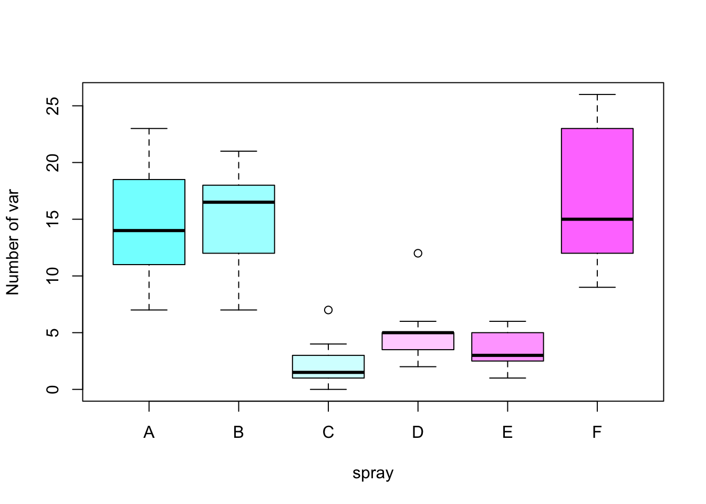

</p>

## Barplots and dotcharts

``` r
par(mar = c(5,4,4,6), xpd = TRUE)
barplot(VADeaths, border = "dark blue", col = rainbow(20), cex.axis =  1.3)
legend("topright", legend = c("Group 1", "Group 2", "Group 3", "Group 4", "Group 5"),  title = "Group types", fill = c(rainbow(20)), cex = 0.8,  box.lty = 0, inset = c(-0.2,0))
```

<p align="center">

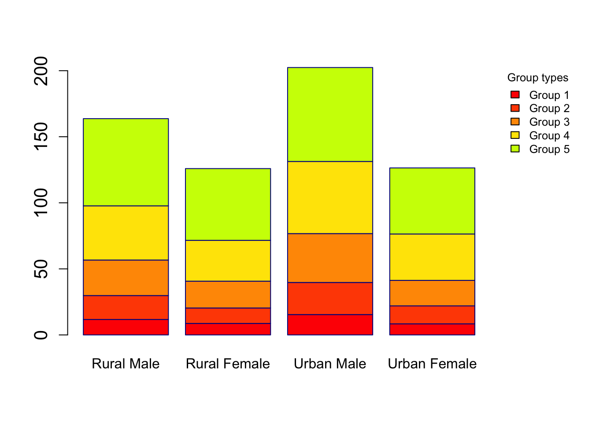

</p>

``` r
eu_data = data.frame(c(1.75,4.5), c(2.8,6.3), c(3.9,6.8), c(4.35,7.2), c(5,8.25),  c(5.3,8.8))
colnames(eu_data) = 2012:2017
rownames(eu_data) = c("US","World")

barplot(as.matrix(eu_data), beside = TRUE, ylab = "Million metric tons", ylim = c(0,10), las = 1, col = gray.colors(2))
legend("top", c("US","World"), fill = gray.colors(2), horiz = TRUE, bty = "n")
```

<p align="center">

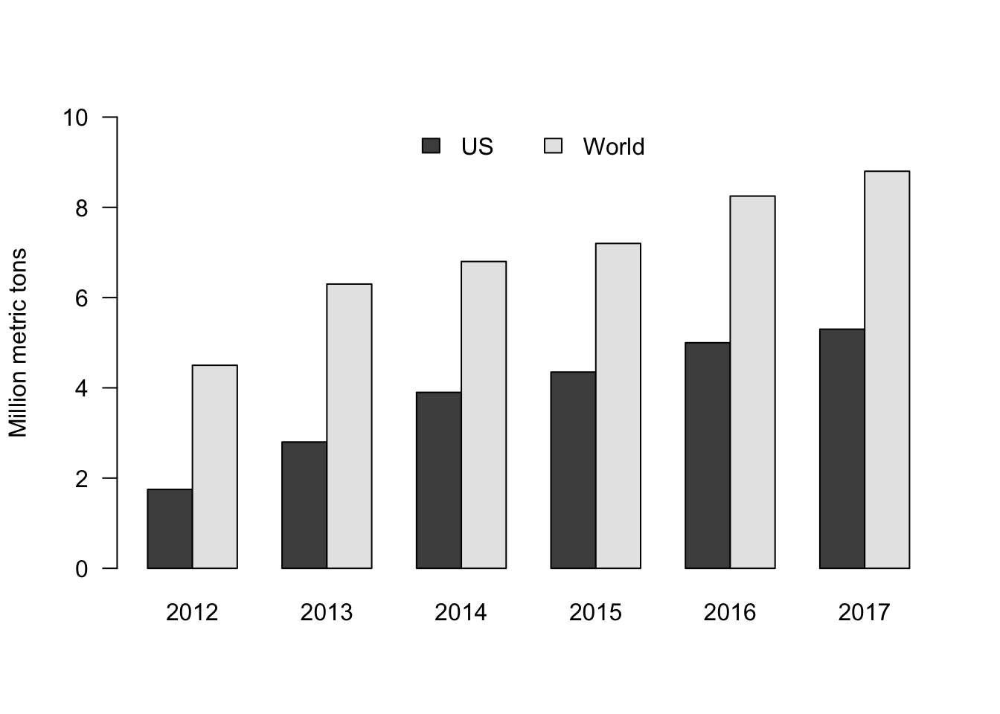

</p>

``` r
dotchart(VADeaths, main = "Death Rates in Virginia1940")
```

<p align="center">

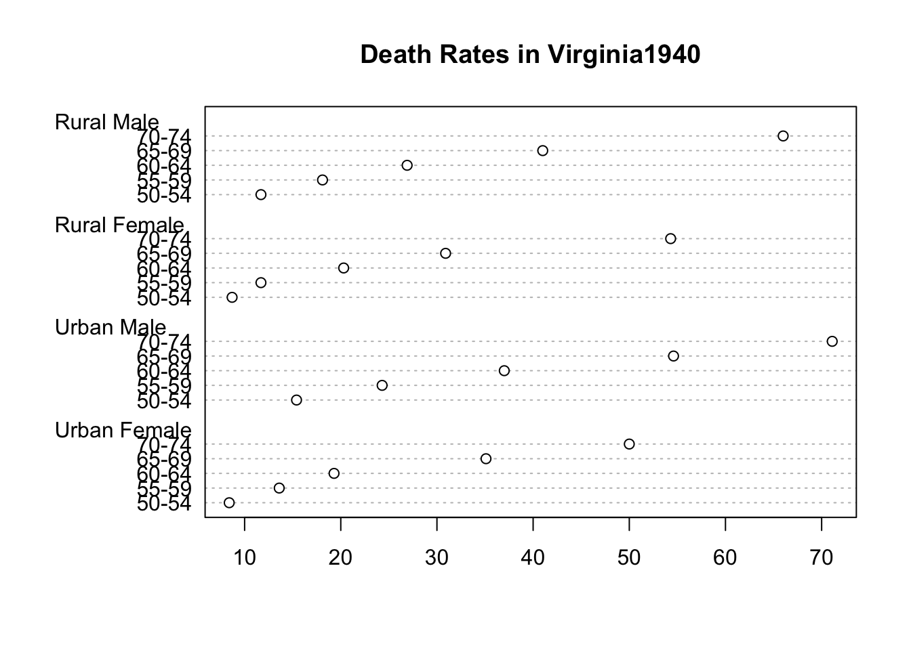

</p>

## Matrix of scatter plots

``` r
pairs(iris[1:4], lower.panel = panel.smooth, upper.panel = NULL, cex = 0.75, cex.labels = 1.5, col = c("red", "blue", "green")[iris$Species], main = "Iris Data - 3 species")
```

<p align="center">

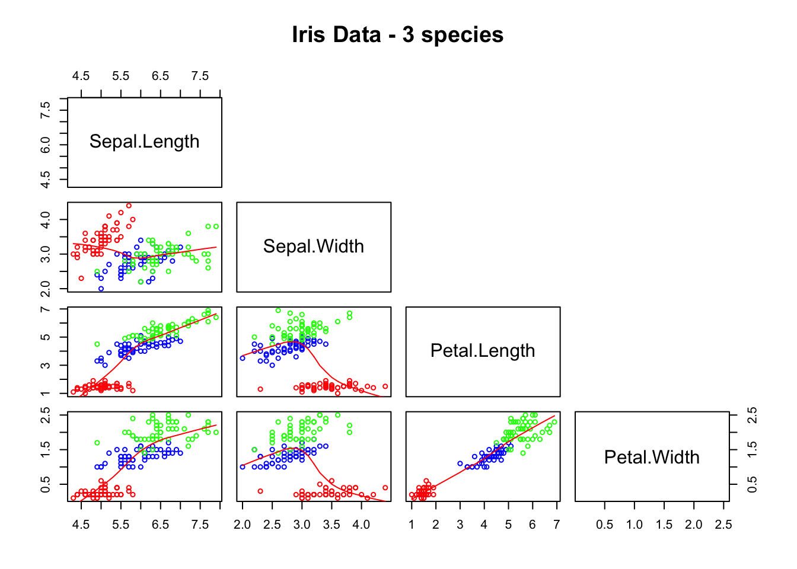

</p>

``` r
pairs(~Sepal.Length + Petal.Length + Species, data = iris, subset = iris$Sepal.Length < 7 , main = "Sepal Length < 7", col = rainbow(length(levels(iris$Species)))[iris$Species])
```

<p align="center">

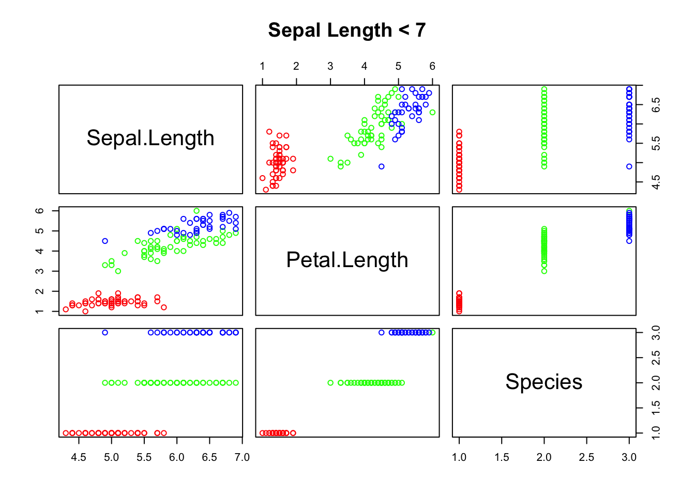

</p>

## Hierarchical clustering

``` r
hca = hclust(eurodist)
plot(hca, main = "Distance between European Cities", hang = -1, ylab = "")
```

<p align="center">

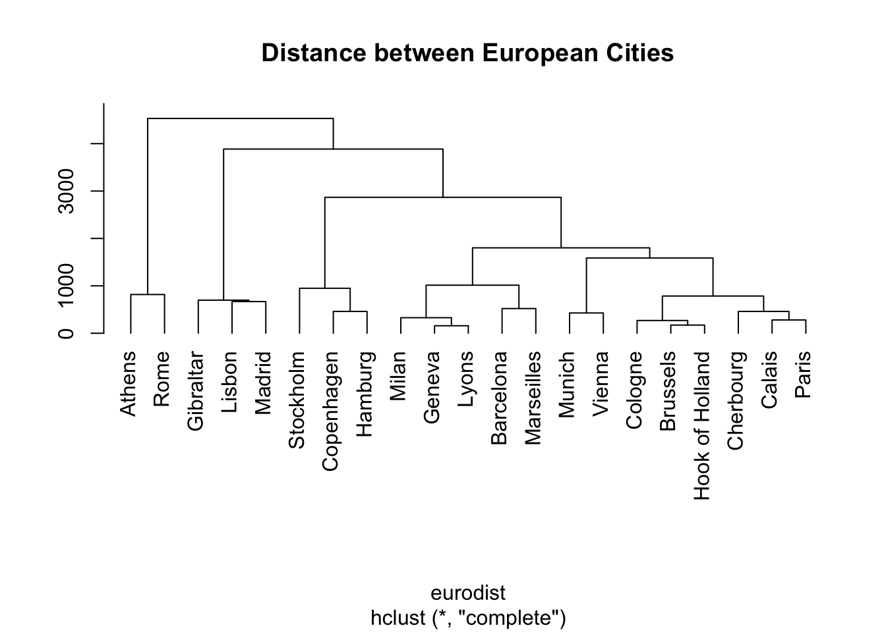

</p>

## Time series

``` r
ts_data = ts(matrix(rt(300*2, df = 3), 300,2), start = c(1961, 1), frequency = 12)
plot(ts_data, main = "Time series")
```

<p align="center">

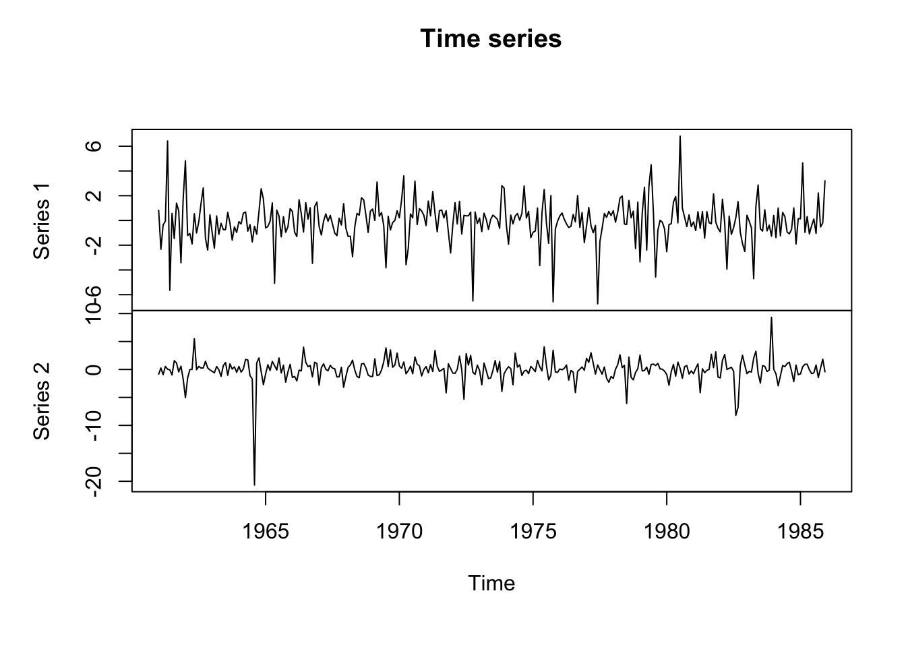

</p>

## Draw functions

For instance we can draw \(y = 4sin(x) + (1 - cos(x))\) by:

``` r
f = function(x) {
  return(4 * sin(x) + (1 - cos(x)))
}

a = c()
seq_ = seq(-2*pi, 2*pi, len = 1000)
for (x in seq_) {
  a = c(a,f(x))
}

plot(x = seq_, y = a, type = "l", xlab = "x", ylab = "y", col = "red")
lines(x = seq_ + 0.5, y = a, col = "blue")
```

<p align="center">

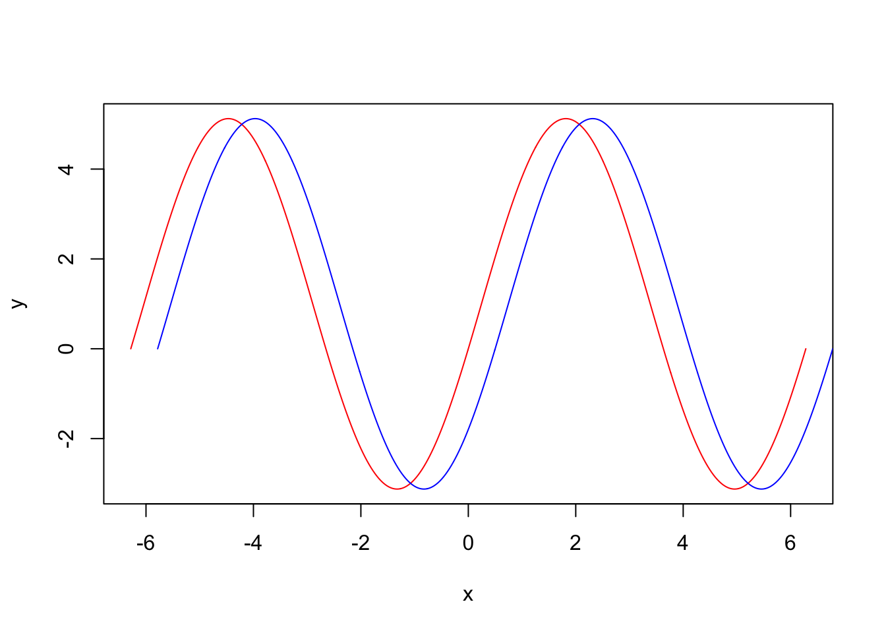

</p>

For another example let’s draw a Ergodic mean plots:

``` r
par(mfrow = c(1,1))
ErgodicMean = function(x, n) {
  quantile_ = matrix(0,n,3)
  for (i in 1:n) {
    quantile_[i,] = quantile(x[1:i], probs = c(0.5,0.025,0.975))
  }
  plot(quantile_[,1], ylim = c(min(quantile_),max(quantile_)), type = "l", ylab = "")
  lines(quantile_[,2], lty = 2, col = "red")
  lines(quantile_[,3], lty = 2, col = "blue") 
}

y = rnorm(100, 0, 2)
ErgodicMean(y, 100)
```

<p align="center">

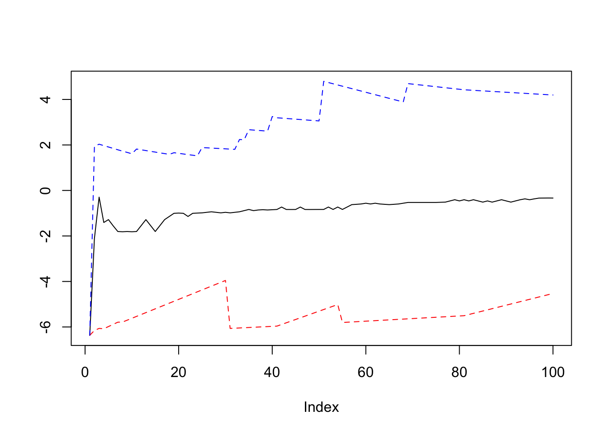

</p>

## Symbols and stars

``` r
par(bty = "n", xaxt = "n", yaxt = "n", ann = FALSE)
symbols(c(0,6), c(2,8), circles = c(2,2), inches = FALSE, bg = c("green", "green"), xlim = c(-2,8), ylim = c(0,10), asp = 1)
symbols(c(0,6), c(8,2), squares = c(4,4), inches = FALSE, bg = c("blue", "blue"), add = TRUE)
```

<p align="center">

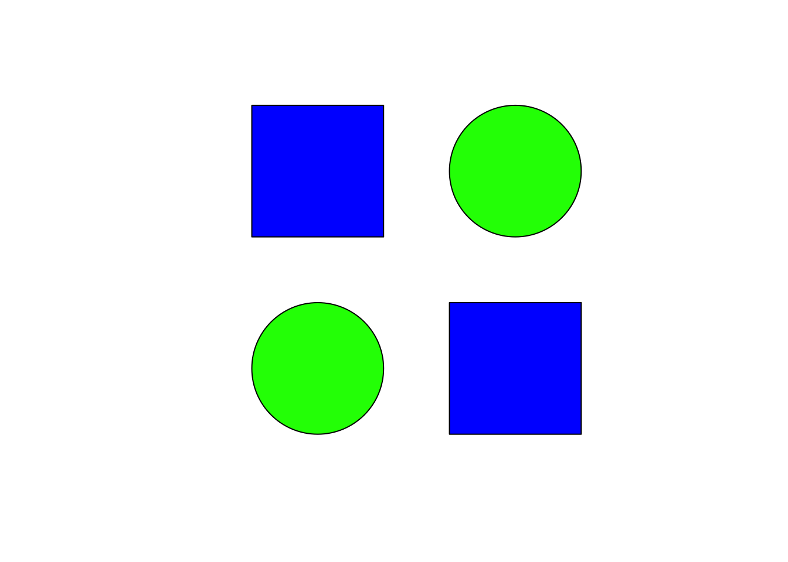

</p>

``` r
stars(mtcars[, 1:7], len = 0.8, key.loc = c(12, 1.5), main = "Motor Trend Cars", draw.segments = TRUE)
```

<p align="center">

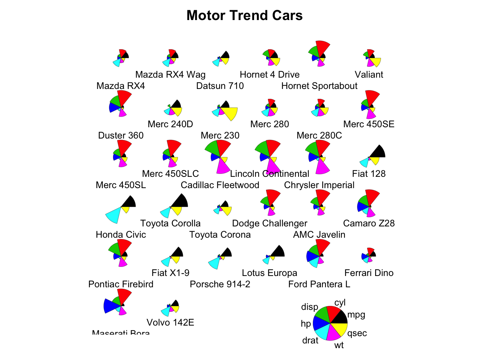

</p>

## Contour, image and perspective

``` r
## Persian Rug Art (R user manual example)
x = y = seq(-4*pi, 4*pi, len = 27)
r = sqrt(outer(x^2, y^2, "+"))
par(mfrow = c(2,2), mar = rep(0, 4), xpd = FALSE)
for(f in pi^(0:3)){
  contour(cos(r^2)*exp(-r/f), drawlabels = FALSE, axes = FALSE, frame = TRUE)
}
```

<p align="center">

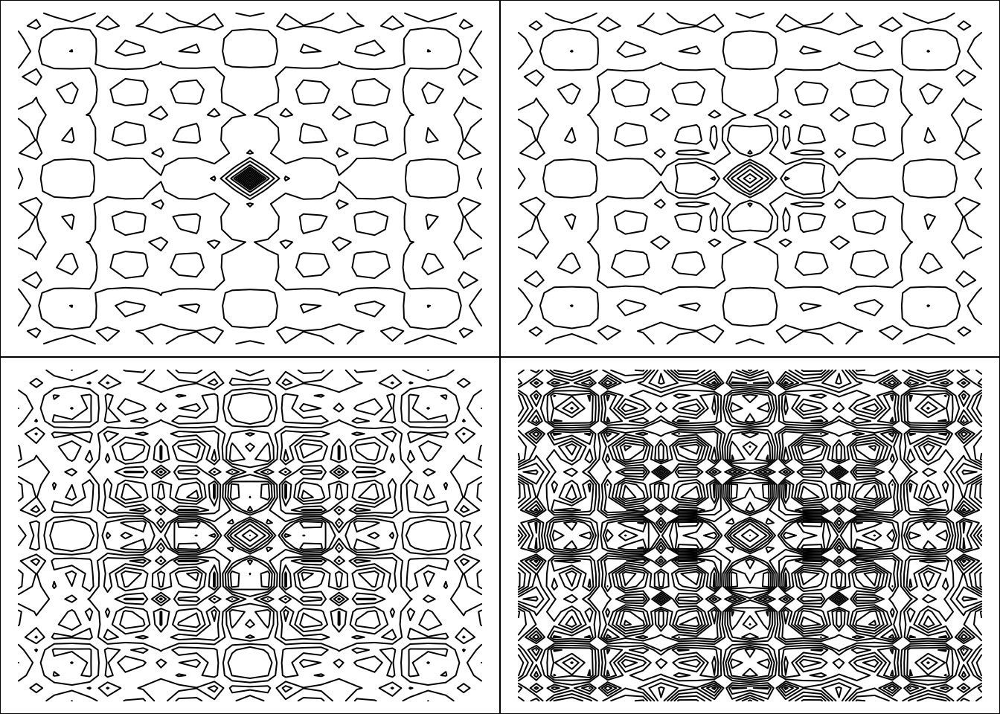

</p>

``` r
x = y = -6:16
z = outer(x, sqrt(abs(x)), FUN = "/")
image(x, y, z)
```

<p align="center">

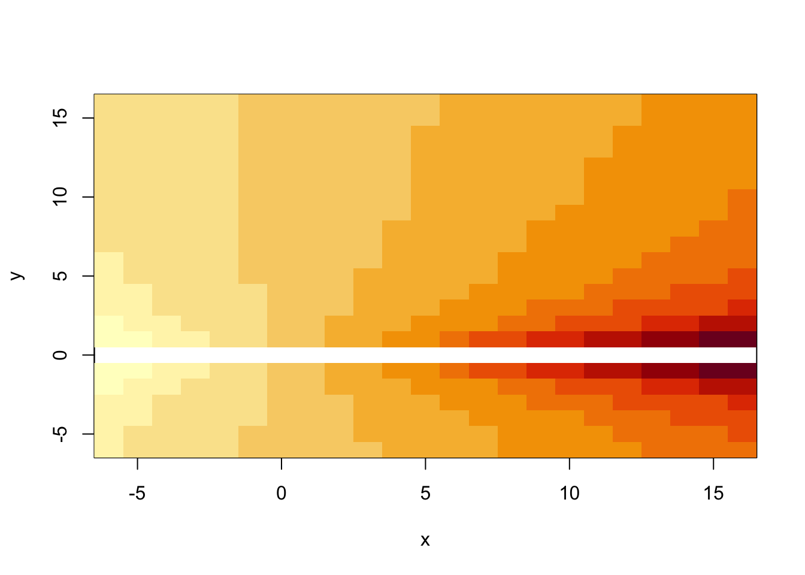

</p>

``` r
x = y = seq(-10, 10, length = 30)
f = function(x, y) {r = sqrt(x^2 + y^2); 10 * sin(r)/r}
z = outer(x, y, f)
z[is.na(z)] = 1
persp(x, y, z, theta = 30, phi = 30, expand = 0.5, col = "lightblue")
```

<p align="center">

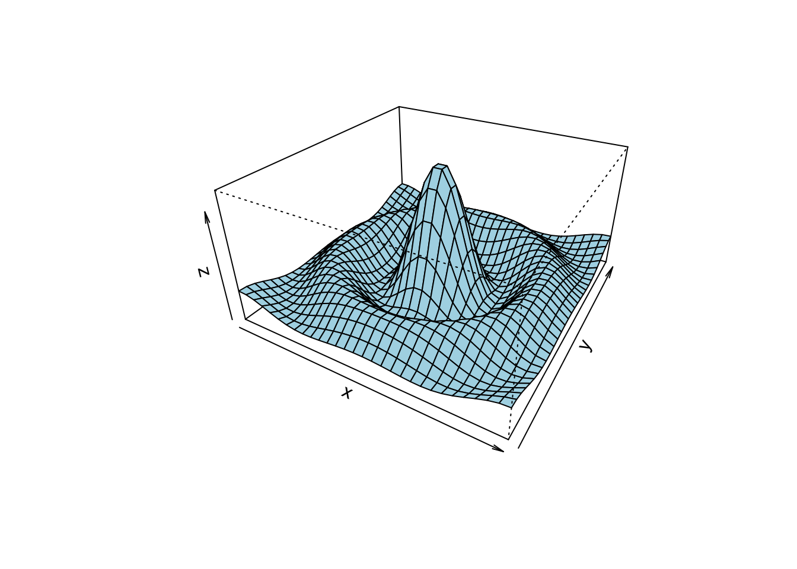

</p>

## Tables

In R we can use `kable` function from `knitr` library to print tables in
HTML or LaTeX formats. `kable` is a great tool, but the generated
outputs are usually not formatted for including in reports. While
building Markdown or Latex reports it will be useful to use the
following packages to make them more publication quality:

  - [kableExtra](https://cran.r-project.org/web/packages/kableExtra/vignettes/awesome_table_in_html.html)
  - [xtable](https://cran.r-project.org/web/packages/xtable/vignettes/xtableGallery.pdf)
  - [stargazer](https://www.jakeruss.com/cheatsheets/stargazer/)

For example:

``` r
library(knitr)
library(kableExtra)
cardata = mtcars
kable(head(cardata), format = "html", caption = "Title of the table") %>%
  kable_styling(full_width = FALSE, font_size = 16, position = "center") # position: left, center, right, float_left and float_right
```

<div style="margin-bottom: 1rem; overflow-x: auto;">

<table class="table">

<thead>

<tr>

<th style="text-align:left;">

</th>

<th style="text-align:right;">

mpg

</th>

<th style="text-align:right;">

cyl

</th>

<th style="text-align:right;">

disp

</th>

<th style="text-align:right;">

hp

</th>

<th style="text-align:right;">

drat

</th>

<th style="text-align:right;">

wt

</th>

<th style="text-align:right;">

qsec

</th>

<th style="text-align:right;">

vs

</th>

<th style="text-align:right;">

am

</th>

<th style="text-align:right;">

gear

</th>

<th style="text-align:right;">

carb

</th>

</tr>

</thead>

<tbody>

<tr>

<td style="text-align:left;">

Mazda RX4

</td>

<td style="text-align:right;">

21.0

</td>

<td style="text-align:right;">

6

</td>

<td style="text-align:right;">

160

</td>

<td style="text-align:right;">

110

</td>

<td style="text-align:right;">

3.90

</td>

<td style="text-align:right;">

2.620

</td>

<td style="text-align:right;">

16.46

</td>

<td style="text-align:right;">

0

</td>

<td style="text-align:right;">

1

</td>

<td style="text-align:right;">

4

</td>

<td style="text-align:right;">

4

</td>

</tr>

<tr>

<td style="text-align:left;">

Mazda RX4 Wag

</td>

<td style="text-align:right;">

21.0

</td>

<td style="text-align:right;">

6

</td>

<td style="text-align:right;">

160

</td>

<td style="text-align:right;">

110

</td>

<td style="text-align:right;">

3.90

</td>

<td style="text-align:right;">

2.875

</td>

<td style="text-align:right;">

17.02

</td>

<td style="text-align:right;">

0

</td>

<td style="text-align:right;">

1

</td>

<td style="text-align:right;">

4

</td>

<td style="text-align:right;">

4

</td>

</tr>

<tr>

<td style="text-align:left;">

Datsun 710

</td>

<td style="text-align:right;">

22.8

</td>

<td style="text-align:right;">

4

</td>

<td style="text-align:right;">

108

</td>

<td style="text-align:right;">

93

</td>

<td style="text-align:right;">

3.85

</td>

<td style="text-align:right;">

2.320

</td>

<td style="text-align:right;">

18.61

</td>

<td style="text-align:right;">

1

</td>

<td style="text-align:right;">

1

</td>

<td style="text-align:right;">

4

</td>

<td style="text-align:right;">

1

</td>

</tr>

<tr>

<td style="text-align:left;">

Hornet 4 Drive

</td>

<td style="text-align:right;">

21.4

</td>

<td style="text-align:right;">

6

</td>

<td style="text-align:right;">

258

</td>

<td style="text-align:right;">

110

</td>

<td style="text-align:right;">

3.08

</td>

<td style="text-align:right;">

3.215

</td>

<td style="text-align:right;">

19.44

</td>

<td style="text-align:right;">

1

</td>

<td style="text-align:right;">

0

</td>

<td style="text-align:right;">

3

</td>

<td style="text-align:right;">

1

</td>

</tr>

<tr>

<td style="text-align:left;">

Hornet Sportabout

</td>

<td style="text-align:right;">

18.7

</td>

<td style="text-align:right;">

8

</td>

<td style="text-align:right;">

360

</td>

<td style="text-align:right;">

175

</td>

<td style="text-align:right;">

3.15

</td>

<td style="text-align:right;">

3.440

</td>

<td style="text-align:right;">

17.02

</td>

<td style="text-align:right;">

0

</td>

<td style="text-align:right;">

0

</td>

<td style="text-align:right;">

3

</td>

<td style="text-align:right;">

2

</td>

</tr>

<tr>

<td style="text-align:left;">

Valiant

</td>

<td style="text-align:right;">

18.1

</td>

<td style="text-align:right;">

6

</td>

<td style="text-align:right;">

225

</td>

<td style="text-align:right;">

105

</td>

<td style="text-align:right;">

2.76

</td>

<td style="text-align:right;">

3.460

</td>

<td style="text-align:right;">

20.22

</td>

<td style="text-align:right;">

1

</td>

<td style="text-align:right;">

0

</td>

<td style="text-align:right;">

3

</td>

<td style="text-align:right;">

1

</td>

</tr>

</tbody>

</table>

</div>

``` r
fm = lm(mpg ~ cyl + disp + hp, data = cardata)
sm = round(summary(fm)$coef,3)

# Adding some cosmetic to columns that we want
row.names(sm) =  cell_spec(row.names(sm), "html", bold = TRUE) 
sm[,4] =  cell_spec(sm[,4], "html", color = ifelse(sm[,4] < 0.1, "red", "black"))

kable(sm, "html", escape = F) %>%
  kable_styling(bootstrap_options = "hover", full_width = FALSE, font_size = 16, position = "center")
```

<div style="margin-bottom: 1rem; overflow-x: auto;">

<table class="table table-hover">

<thead>

<tr>

<th style="text-align:left;">

</th>

<th style="text-align:left;">

Estimate

</th>

<th style="text-align:left;">

Std. Error

</th>

<th style="text-align:left;">

t value

</th>

<th style="text-align:left;">

Pr(\>|t|)

</th>

</tr>

</thead>

<tbody>

<tr>

<td style="text-align:left;">

<span style="font-weight: bold;">(Intercept)</span>

</td>

<td style="text-align:left;">

34.185

</td>

<td style="text-align:left;">

2.591

</td>

<td style="text-align:left;">

13.195

</td>

<td style="text-align:left;">

<span style="color: red !important;">0</span>

</td>

</tr>

<tr>

<td style="text-align:left;">

<span style="font-weight: bold;">cyl</span>

</td>

<td style="text-align:left;">

\-1.227

</td>

<td style="text-align:left;">

0.797

</td>

<td style="text-align:left;">

\-1.54

</td>

<td style="text-align:left;">

<span style="color: black !important;">0.135</span>

</td>

</tr>

<tr>

<td style="text-align:left;">

<span style="font-weight: bold;">disp</span>

</td>

<td style="text-align:left;">

\-0.019

</td>

<td style="text-align:left;">

0.01

</td>

<td style="text-align:left;">

\-1.811

</td>

<td style="text-align:left;">

<span style="color: red !important;">0.081</span>

</td>

</tr>

<tr>

<td style="text-align:left;">

<span style="font-weight: bold;">hp</span>

</td>

<td style="text-align:left;">

\-0.015

</td>

<td style="text-align:left;">

0.015

</td>

<td style="text-align:left;">

\-1.002

</td>

<td style="text-align:left;">

<span style="color: black !important;">0.325</span>

</td>

</tr>

</tbody>

</table>

</div>

## Maps

R does not have default functions for drawing maps and shapefiles. To
generate maps, we can use the following packages:

  - [maps](https://cran.r-project.org/web/packages/maps/maps.pdf): draw
    lines and polygons as specified by a map database
  - [sf](https://r-spatial.github.io/sf/): provide [Simple
    Features](https://r-spatial.github.io/sf/articles/sf1.html) for R.
    Find more details about *sf* in
    [here](https://r-spatial.github.io/sf/articles/sf5.html) and in the
    [cheetsheet](https://github.com/rstudio/cheatsheets/blob/master/sf.pdf)
  - [leaflet](https://rstudio.github.io/leaflet/): create interactive
    maps. The widget can be rendered on HTML pages generated from R
    Markdown, Shiny, or other applications. You may learn more about
    *leaflet* in [here](https://rpubs.com/mattdray/basic-leaflet-maps)

## Layout

`layout` creates a layout for putting multiple plots together. Number of
rows and columns are specified in a matrix, with the column-widths and
the row-heights specified in the respective arguments.

``` r
lay = layout(matrix(c(1,0,2,3,4,0),3,2,byrow = TRUE), widths = c(4,1.5), heights = c(1.5,4,1), respect = TRUE)
layout.show(lay)
```

<p align="center">

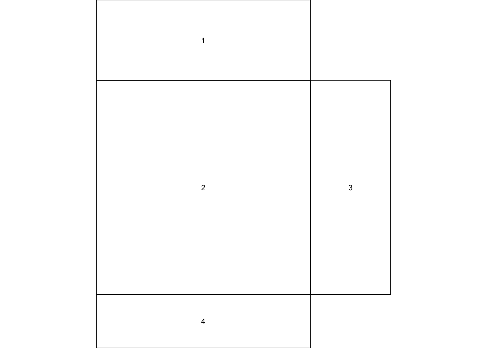

</p>

``` r
x = pmin(3, pmax(-3, rnorm(100)))
y = pmin(3, pmax(-3, rnorm(100)))
xhist = hist(x, breaks = seq(-3,3,0.5), plot = FALSE)
yhist = hist(y, breaks = seq(-3,3,0.5), plot = FALSE)
top = max(c(xhist$counts, yhist$counts))

par(mar = c(0,3,3,1))
plot(xhist, col = "gray", axes = FALSE, xlab = "", ylab = "", main = "")
title(main = "Main Title", cex.main = 1.5)

par(mar = c(4,3,1,1))
plot(x[1:15], y[1:15], xlim = c(-3, 3), ylim = c(-3, 3), xlab = "x variable", ylab = "", cex.lab = 1.2)
arrows(x[1:15], y[1:15]-0.5, x[1:15], y[1:15]+0.5, col = 4, angle = 90, length = 0.05, code = 3)

par(mar = c(3,0,1,1))
barplot(yhist$counts, axes = FALSE, xlim = c(0, top), space = 0, horiz = TRUE, col = "black", bg = "gray", density = 20)

par(mar = c(0,3,0,0))
plot.new()
legend("center", legend = c("Top", "Middle", "Right"), fill = c("gray", "white", "black"), density = c(-1,-1,40), bg = "gray90", horiz = TRUE)
```

<p align="center">

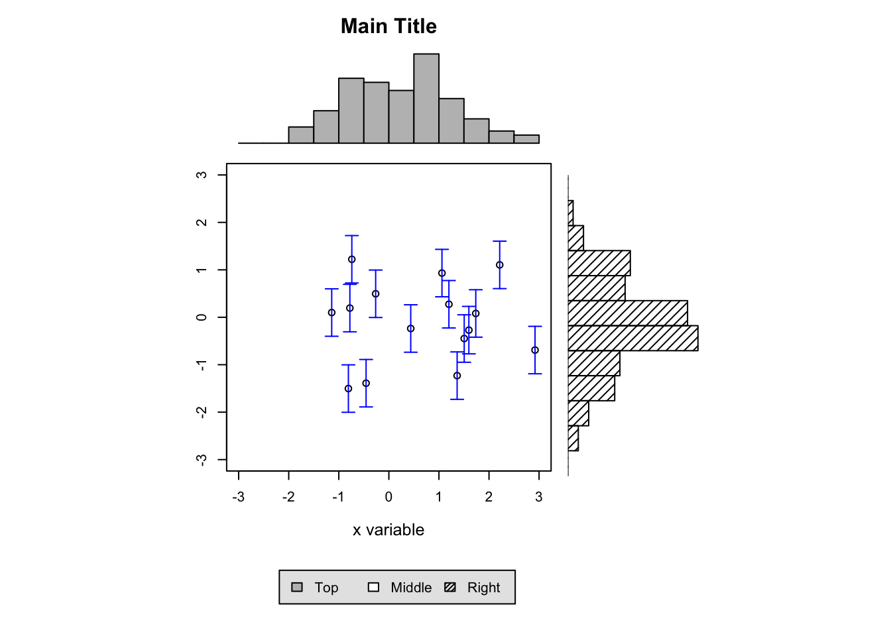

</p>

## Color palettes

R also offers the following built in color palettes that help to
generate color vectors of desired length quickly.

  - `rainbow()`
  - `colorRampPalette()`
  - `heat.colors()`
  - `gray.colors()`
  - `terrain.colors()`
  - `topo.colors()`
  - `cm.colors()`

<!-- end list -->

``` r
par(mfrow = c(1,2))
pie(rep(1, 24), col = rainbow(24), radius = 1)
pie(rep(1, 24), col = colorRampPalette(c("red","yellow","springgreen","royalblue"))(24), radius = 1)
```

<p align="center">

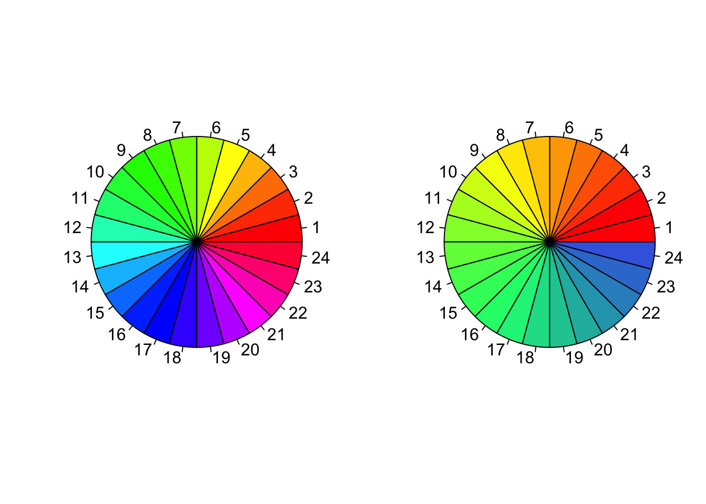

</p>

``` r
pie(rep(1, 24), col = heat.colors(24), radius = 1)
pie(rep(1, 24), col = terrain.colors(24), radius = 1)
```

<p align="center">

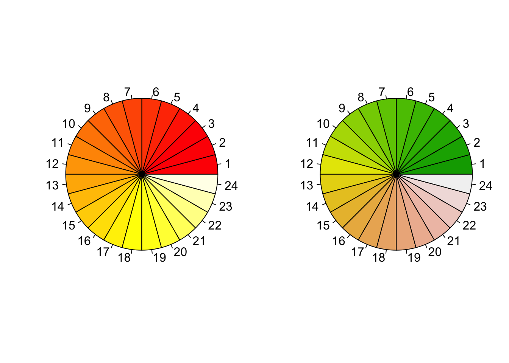

</p>

``` r
pie(rep(1, 24), col = topo.colors(24), radius = 1)
pie(rep(1, 24), col = cm.colors(24), radius = 1)
```

<p align="center">

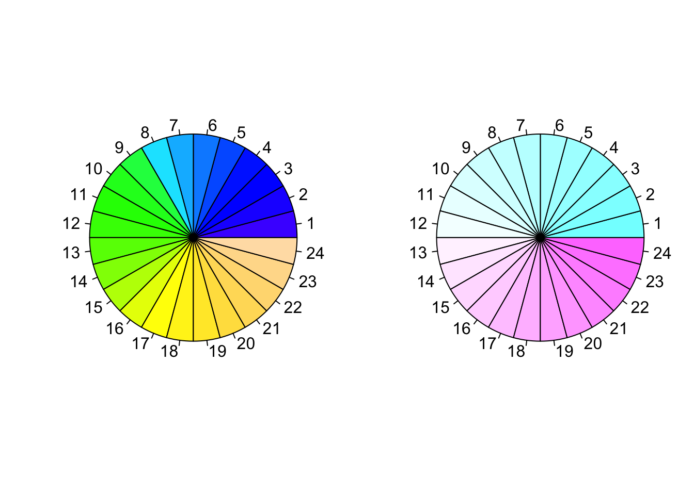

</p>

---

Copyright 2018-2019, [Ashkan Mirzaee](https://ashki23.github.io/index.html) | Content is available under [CC BY-SA 3.0](https://creativecommons.org/licenses/by-sa/3.0/) | Sourcecode licensed under [GPL-3.0](https://www.gnu.org/licenses/gpl-3.0.en.html)
